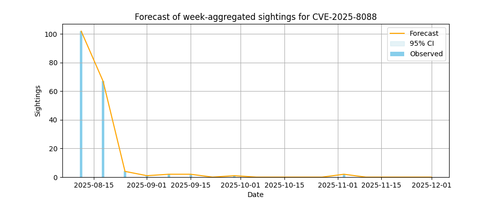
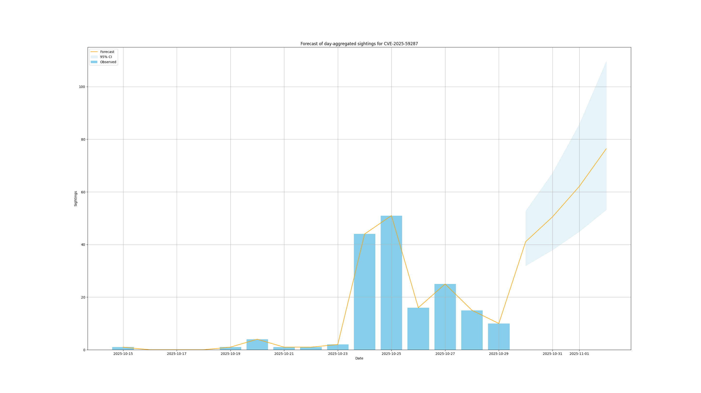

# TARDISsight

## Usage


### Examples

Using SARIMAX Log-transform counts WITHOUT seasonal components.

```bash
python forecast1.py
```

#### Sightings forecast for CVE-2025-54236 on 10/29/2025


#### Sightings forecast for CVE-2025-8088 on 10/29/2025


SARIMAX needs a lot more data for this use case.


#### Sightings forecast for CVE-2025-8088 on 10/30/2025

```bash
python forecast2.py
```

Poisson-based Forecast of Vulnerability Sightings (Adaptive Daily/Weekly)




#### Sightings forecast for CVE-2025-59287 on 10/30/2025

Poisson-based Forecast of Vulnerability Sightings (Adaptive Daily/Weekly)

