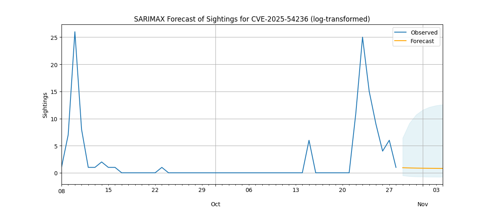
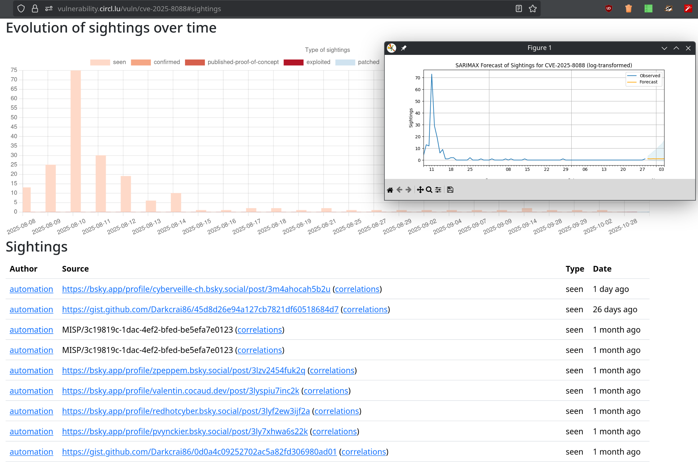

# TARDISsight

## Usage


```bash
python forecast1.py
```

### Examples

Using SARIMAX Log-transform counts WITHOUT seasonal components.

#### Sightings forecast for CVE-2025-54236 on 10/29/2025




#### Sightings forecast for CVE-2025-8088 on 10/29/2025





SARIMAX needs a lot more data for this use case.