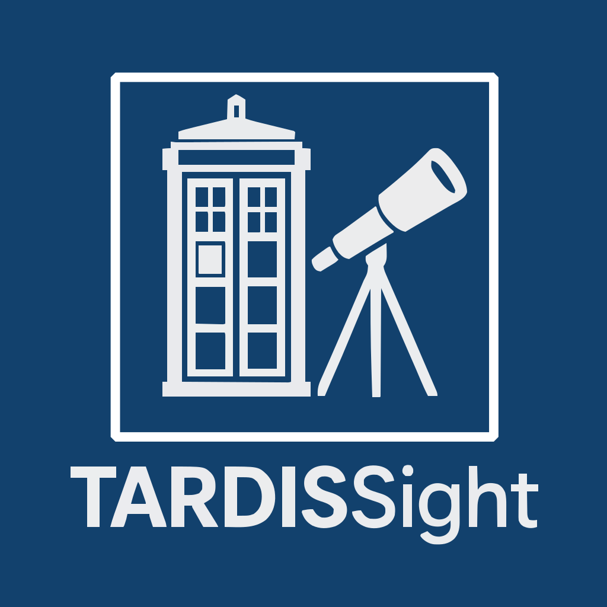

# TARDISsight

## Documentation

You can find information about the various experiments in the ``docs`` folder.

## Related resources

**Sightings report:**

- [End-of-Year Threat Intelligence Sightings Forecast](https://www.vulnerability-lookup.org/2025/12/02/end-of-year-threat-intelligence-sightings-forecast/) (commit id: 4c0b684)

## License

[TARDISsight](https://github.com/vulnerability-lookup/TARDISsight) is licensed under
[GNU General Public License version 3](https://www.gnu.org/licenses/gpl-3.0.html)

~~~
Copyright (c) 2025-2026 Computer Incident Response Center Luxembourg (CIRCL)
Copyright (C) 2025-2026 Cédric Bonhomme - https://github.com/cedricbonhomme
~~~

