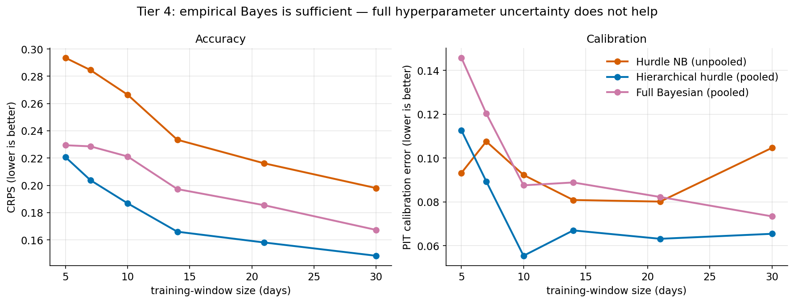

# Full Bayesian pooling (Tier 4)

This document covers the Tier-4 prototype: a **fully Bayesian** version of the
hierarchical hurdle from Tier 2 (see [`pooling.md`](pooling.md)), built to test a
conjecture left open there. It is further support for the VulnOptiCON follow-up to
arXiv:2604.16038.

## The question

Tier 2 pooled each CVE toward a population using **empirical Bayes**: the
population hyperparameters were *point* estimates (method of moments), and their
uncertainty was ignored. We speculated in the Tier-2 write-up that a fully
Bayesian treatment — propagating hyperparameter uncertainty — would likely improve
calibration, especially at the shortest training windows. Tier 4 tests that
conjecture directly. **The answer is no**, and the reason is instructive.

## Model

We keep the exact two-part structure (activity Beta–Binomial, burst-size
Gamma–Poisson) and make it fully Bayesian without a heavy dependency
(numpy/scipy only — no PyMC/Stan). The enabling trick is conjugacy: the per-CVE
parameters integrate out in closed form, so only the four population
hyperparameters $(a, b, \kappa, \theta)$ remain, and we sample their joint
posterior with a small random-walk Metropolis sampler (log-space,
weakly-informative log-Normal priors). Marginal hyper-likelihoods:

* **Activity** — Beta–Binomial: with $k_c$ active days of $n_c$,
  $\log L(a,b) = \sum_c \big[\,\mathrm{B}(a+k_c,\,b+n_c-k_c) - \mathrm{B}(a,b)\,\big]$
  (log Beta function).
* **Burst** — Gamma–Poisson (Negative-Binomial marginal) over $(S_c, A_c)$ =
  (total sightings, active days).

A forecast then propagates **three** layers of uncertainty: the hyperparameter
posterior → the per-CVE conjugate posterior ($p_c \mid k_c,n_c$ and
$\lambda_c \mid S_c,A_c$) → count sampling. The empirical-Bayes model collapses
the first two layers to point values.

A sanity check confirms the sampler is correct: its posterior means coincide with
the empirical-Bayes point estimates (mean activity 0.220 vs 0.208, 95% CI
0.15–0.30; mean burst rate 2.165 vs 2.137, 95% CI 1.75–2.68), now with credible
intervals around them.

## Experiment

Identical data-starvation protocol to Tiers 2–3 (fixed window $W$, leave-one-out
population fit, 24 CVEs, $H=7$). We compare the full Bayesian model against the
empirical-Bayes pooled model (Tier 2) and the best unpooled model (Tier 1), on
both CRPS and PIT calibration. Reproduce: `python -m tardissight.eval.run_bayes 2>/dev/null`.

## Results

**CRPS by window** (lower is better):

| model | W=5 | W=7 | W=10 | W=14 | W=21 | W=30 |
|---|---:|---:|---:|---:|---:|---:|
| hier_hurdle (empirical Bayes) | **0.221** | **0.204** | **0.187** | **0.166** | **0.158** | **0.148** |
| bayes_hurdle (full Bayesian) | 0.229 | 0.229 | 0.221 | 0.197 | 0.185 | 0.167 |
| indep_hurdle_nb (unpooled) | 0.293 | 0.285 | 0.266 | 0.233 | 0.216 | 0.198 |

**PIT calibration error by window** (lower is better):

| model | W=5 | W=7 | W=10 | W=14 | W=21 | W=30 |
|---|---:|---:|---:|---:|---:|---:|
| hier_hurdle (empirical Bayes) | **0.113** | **0.089** | **0.055** | **0.067** | **0.063** | 0.065 |
| bayes_hurdle (full Bayesian) | 0.146 | 0.120 | 0.088 | 0.089 | 0.082 | 0.073 |
| indep_hurdle_nb (unpooled) | 0.093 | 0.108 | 0.092 | 0.081 | 0.080 | 0.105 |

(The empirical-Bayes row reproduces the Tier-2 numbers exactly — a consistency
check on the harness.) 80% interval coverage: empirical Bayes ~0.96, full Bayesian
~0.97, both over-covering the nominal 0.80.

## Finding: empirical Bayes is sufficient (a useful negative result)

The full Bayesian model is **slightly worse than empirical Bayes on both accuracy
and calibration, at every window** — the opposite of the Tier-2 conjecture. The
mechanism is clear once stated:

* On these sparse, zero-dominated series **every** model already *over-covers*
  (empirical coverage ~0.96 against a nominal 0.80) — the predictive
  distributions are, if anything, **too wide**, not too narrow.
* Propagating hyperparameter uncertainty can only make the predictive **wider
  still**. It therefore moves coverage further from nominal and makes the
  forecasts less sharp — degrading CRPS and PIT rather than improving them.

In other words, the binding constraint here is *excess* dispersion (from the
structural zeros and the independent activity×burst construction), not the
*under*-confidence that hyperparameter uncertainty would remedy. Adding more
uncertainty addresses a problem this data does not have.

The practical conclusion is therefore valuable precisely because it is negative:
**the cheap empirical-Bayes pooling of Tier 2 is the sweet spot; a full MCMC
treatment is not warranted for this regime.** This also corrects the speculative
remark in `pooling.md`/the draft paper that full Bayes would close the
short-window gap — empirically it does not.

## Implications and next steps

If the limiting factor is over-dispersion rather than parameter uncertainty, the
productive direction is a **tighter likelihood**, not more pooling machinery:
e.g.\ modelling the activity/burst dependence (so the two components are not
multiplied as independent over-dispersed factors), or a zero-inflated rather than
hurdle formulation. The Bayesian sampler remains useful where one specifically
needs calibrated *credible intervals on the population parameters themselves*
(reported above), even though it does not improve point-in-time forecasts.
