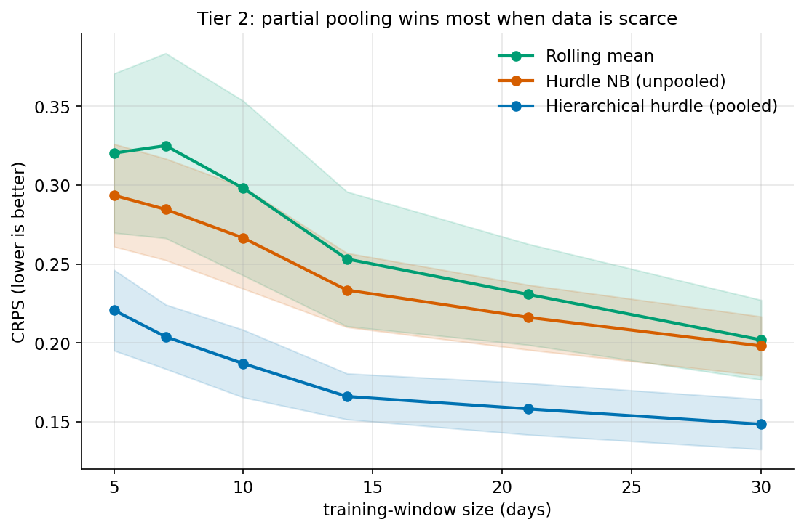
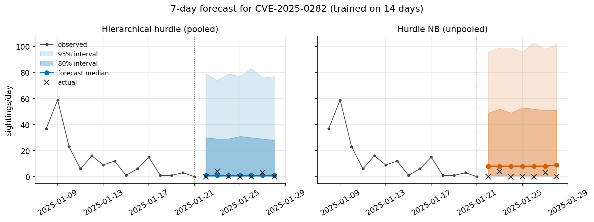

# Hierarchical pooling across CVEs (Tier 2)

This document describes the Tier-2 prototype: a **partially pooled (hierarchical)**
forecasting model that lets a data-poor CVE borrow strength from a population of
past CVEs. It builds on the evaluation harness and the hurdle Negative-Binomial
model from Tier 1 (see [`evaluation.md`](evaluation.md)). It is further
experimental support for the VulnOptiCON follow-up to arXiv:2604.16038.

## The problem pooling addresses

Tier 1's clearest structural finding is that the hurdle Negative-Binomial is the
best-*calibrated* count model, but it — like every Tier-1 model — was fit on a
single CVE in isolation. The first paper's central constraint is that a single
CVE carries very little data (10–30 days, mostly zeros). Estimating an activity
rate and a burst size from so few points is unstable, which is why the simple
rolling mean was so hard to beat.

Pooling changes the unit of learning. Instead of "fit this CVE alone", we assume
every CVE's parameters are draws from a shared population:

```
activity rate    p_c   ~ Beta(a, b)
burst-size rate  lam_c ~ Gamma(shape, rate)
```

The population hyperparameters are learned from a back-catalogue of past CVEs,
and each CVE's own estimate is then **shrunk toward the population mean** by an
amount that depends on how much data it has. A brand-new CVE starts essentially
at the population average and moves toward its own behaviour as evidence
accumulates. This is leverage a single-series model structurally cannot have.

## Model (empirical-Bayes prototype)

We reuse the Tier-1 hurdle decomposition (activity × burst size) because it won
on calibration, and pool each part with a conjugate prior:

* **Activity** — Beta–Binomial. Posterior mean
  `p_hat = (active_days + a) / (n_days + a + b)`.
* **Burst size** — Gamma–Poisson. Posterior mean of the rate
  `lam_hat = (total_sightings + shape) / (active_days + rate)`. Burst sizes are
  drawn as `1 + NegBin(mean = lam_hat − 1)` so they are ≥ 1 (the hurdle
  assumption), with a single **pooled** over-dispersion `alpha` estimated from
  all positive daily counts across the corpus.

Hyperparameters `(a, b)`, `(shape, rate)` and `alpha` are estimated by **method
of moments** across CVEs (empirical Bayes) — no MCMC. This is a deliberate
prototype choice: it is dependency-light (numpy/scipy), instant to fit, and
enough to answer "does pooling help?" before committing to a full Bayesian
(PyMC/NumPyro) model that would also propagate hyperparameter uncertainty.

## Experiment: data-starvation backtest

To isolate the effect pooling is supposed to have — helping when data is scarce —
we restrict every model to a short, fixed trailing window of `W` days and sweep
`W`. If pooling works, `hier_hurdle` should beat the unpooled best count model
most at small `W`, with the gap closing as `W` grows.

* **Leave-one-out prior (no leakage).** When forecasting CVE `c`, the population
  prior is estimated only from the *other* CVEs' full histories — the realistic
  setting of a new CVE arriving against an existing back-catalogue.
* **Models.** `hier_hurdle` (this prototype) vs `indep_hurdle_nb` (Tier-1's best
  count model fit on the window alone) vs `rolling_mean` (Tier-1's strongest
  baseline).
* **Corpus.** 24 CVEs (the 6 paper CVEs + 18 high-profile exploited CVEs); see
  `tardissight/corpus.py`. Horizon = 7 days, `n_samples = 1000`, ≤ 40 origins per
  CVE-window.

Reproduce:

```bash
python -m tardissight.eval.run_pooling 2>/dev/null   # result tables on stdout
```

(Very short training windows make the unpooled statsmodels fits emit expected
separation/convergence warnings on stderr — they are handled by the models'
fallbacks; redirect stderr to keep the tables readable.)

## Results

<!-- RESULTS-START -->
Population prior (full 24-CVE corpus): mean activity **0.208** (~21% of days have
any sighting), mean burst rate **2.137** sightings per active day, pooled NB
dispersion **alpha = 4.52** (strong over-dispersion — quantitative justification
for NB over Poisson at the population level).



**CRPS by training-window size** (lower is better):

| model | W=5 | W=7 | W=10 | W=14 | W=21 | W=30 |
|---|---:|---:|---:|---:|---:|---:|
| **hier_hurdle** | **0.221** | **0.204** | **0.187** | **0.166** | **0.158** | **0.148** |
| indep_hurdle_nb | 0.293 | 0.285 | 0.266 | 0.233 | 0.216 | 0.198 |
| rolling_mean | 0.320 | 0.325 | 0.298 | 0.253 | 0.231 | 0.202 |

**PIT calibration error by window** (lower is better):

| model | W=5 | W=7 | W=10 | W=14 | W=21 | W=30 |
|---|---:|---:|---:|---:|---:|---:|
| hier_hurdle | 0.113 | 0.089 | 0.055 | 0.067 | 0.063 | 0.065 |
| indep_hurdle_nb | 0.093 | 0.108 | 0.092 | 0.081 | 0.080 | 0.105 |
| rolling_mean | 0.063 | 0.079 | 0.077 | 0.080 | 0.070 | 0.097 |

80% interval coverage is ~0.94–0.97 for all models (over-covering the nominal
0.80 — the structural-zeros inflation already noted in Tier 1; PIT is the
reliable calibration gauge).

A single forecast makes the mechanism concrete. Trained on a 14-day window that
*ends in a burst*, the pooled model shrinks its expectation toward the population
(correctly anticipating the fade to near-zero that follows), while the unpooled
hurdle stays high and opens a very wide interval — the count-model echo of the
first paper's "exploding CI":


<!-- RESULTS-END -->

## Findings

<!-- FINDINGS-START -->
1. **Pooling wins at every window size, and most where data is scarcest.** The
   hierarchical hurdle has the lowest CRPS for all `W`. At `W=5` it cuts CRPS by
   ~25% vs the unpooled hurdle (0.221 vs 0.293) and ~31% vs the rolling mean
   (0.320). This is the headline Tier-2 result: borrowing strength from the
   population directly addresses the data-scarcity the first paper identified as
   the core obstacle.

2. **Pooling buys a ~3× data-efficiency improvement.** The pooled model with only
   10 days of history (CRPS 0.187) is already better than the unpooled hurdle
   with 30 days (0.198), and the pooled model at 7 days (0.204) matches the
   unpooled model at 30 days. In operational terms: with a population prior we
   reach in ~10 days what an isolated model does not reach even in a month.

3. **The unpooled hurdle confirms the Tier-1 ordering.** `indep_hurdle_nb` still
   beats the rolling mean at every window here — consistent with Tier 1 — but
   both are clearly dominated by the pooled model.

4. **Calibration is competitive and improves with data.** From `W>=10` the
   pooled model's PIT error (~0.055–0.067) is the best or tied-best. At the
   extreme `W=5` it is slightly less calibrated than the rolling mean (0.113 vs
   0.063) — when almost completely starved the forecast is prior-dominated and a
   touch over-confident — yet its CRPS is far lower, i.e. it is sharper and only
   marginally less calibrated. A full Bayesian treatment (propagating
   hyperparameter uncertainty) would likely close this small `W=5` calibration
   gap.

### Takeaway for the paper

Partial pooling is the most effective lever found so far for the sparse,
short-series regime: a hierarchical hurdle Negative-Binomial dominates both the
best unpooled count model and the strong rolling-mean baseline across all
training-window sizes, with the largest gains exactly where the first paper
struggled (very little per-CVE data). The empirical-Bayes prototype is enough to
establish this; the natural next step is a full Bayesian hierarchical model for
proper uncertainty, and adding time-varying covariates (day-of-week, EPSS
dynamics) and sighting `type` as a second pooled dimension.

### Prototype limitations (to address before publication)

- Empirical Bayes uses point hyperparameters (no uncertainty propagation).
- A single **pooled** burst-size dispersion is shared by all CVEs rather than
  itself being a per-CVE random effect.
- The activity and burst components are pooled independently (no modelled
  correlation between "how often" and "how big").
- The population prior is estimated from full back-catalogue histories; an
  online variant would update it as new CVEs accrue.
<!-- FINDINGS-END -->
