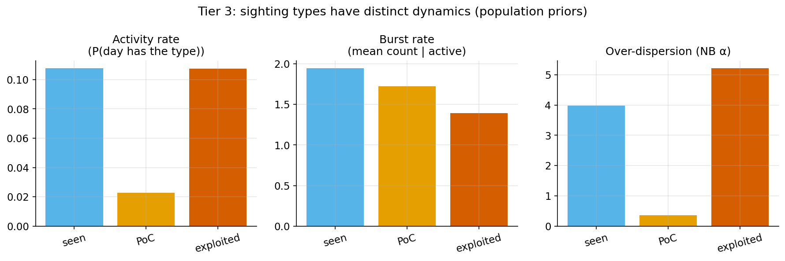
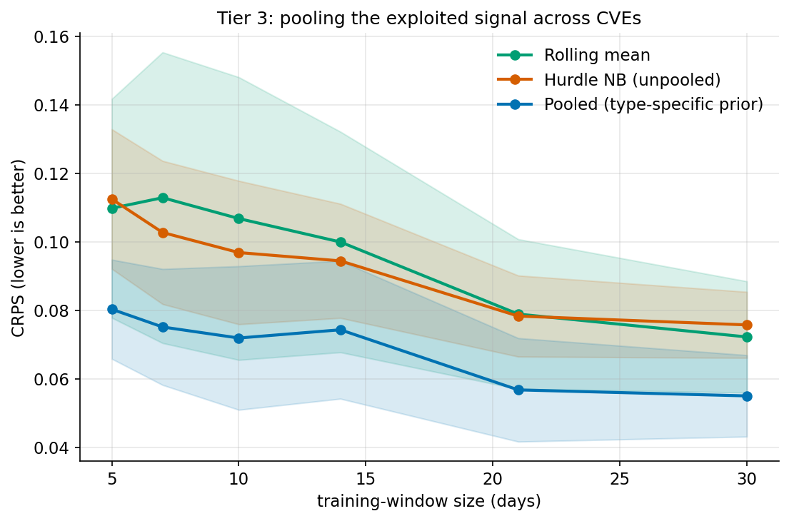
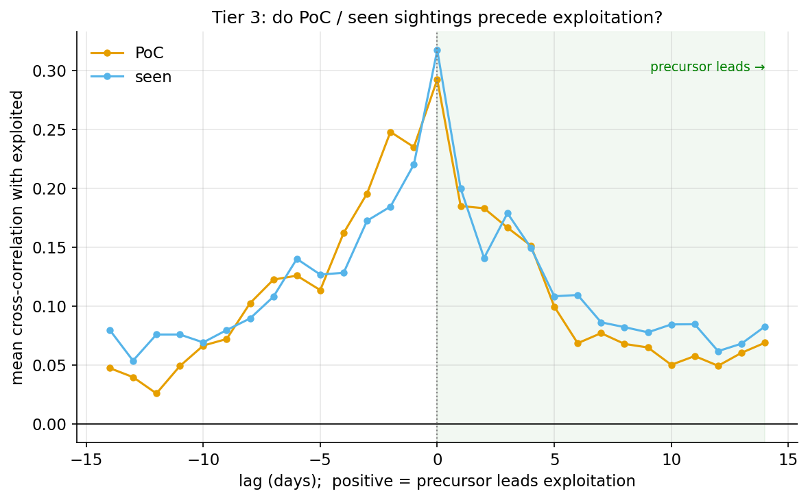

# Modelling sighting type (Tier 3)

This document covers the Tier-3 prototype: forecasting sightings **by type**
(`seen` / `published-proof-of-concept` / `exploited`) rather than as one
undifferentiated stream. It builds on the pooled hurdle of Tier 2 (see
[`pooling.md`](pooling.md)) and is further support for the VulnOptiCON follow-up
to arXiv:2604.16038.

## Why type matters

The first paper's own future work states: *"all sightings are treated as
equivalent, regardless of their type … we aim to incorporate both the different
types of sightings and the severity scores … It could help us establish a link
with the actual exploitation of a vulnerability."* Tiers 1–2 pooled the **total**
daily count; Tier 3 pools **each type separately**.

The types are not interchangeable — their population priors differ sharply:

| type | activity rate | burst rate | NB α (dispersion) |
|---|---:|---:|---:|
| seen | 0.108 | 1.943 | 3.99 |
| published-proof-of-concept | 0.023 | 1.724 | 0.36 |
| exploited | 0.107 | 1.392 | 5.21 |

`published-proof-of-concept` is a *rare, punctual* event (active on ~2% of days,
low dispersion — a PoC drops once); `exploited` is the *burstiest* stream
(highest dispersion); `seen` is the steady background chatter. A single pooled
total blends these; per-type pooling lets each shrink toward *its own*
population. (`confirmed` and `patched` together are <0.1% of records and are
dropped.)

## Model

`TypedHierarchicalHurdle` reuses the Tier-2 `HierarchicalHurdle` once per type,
each with a type-specific population prior, and forecasts the total as the sum of
the per-type predictive samples. Per-type samples are currently drawn
independently — an acknowledged simplification, since a PoC release and
subsequent exploitation are correlated (see lead-lag below). No new dependencies.

## Experiments and results

Reproduce: `python -m tardissight.eval.run_typed 2>/dev/null`.

### 1. Does pooling help the high-value `exploited` signal? (headline — yes)

Per CVE the exploited stream is even scarcer than the total, so the Tier-2
pooling argument should apply with more force. Same data-starvation backtest
(fixed window `W`, leave-one-out prior), now on the exploited-only series:

**Exploited-signal CRPS** (lower is better):

| model | W=5 | W=7 | W=10 | W=14 | W=21 | W=30 |
|---|---:|---:|---:|---:|---:|---:|
| **hier_exploited** (pooled) | **0.080** | **0.075** | **0.072** | **0.074** | **0.057** | **0.055** |
| indep_hurdle_nb (unpooled) | 0.112 | 0.103 | 0.097 | 0.094 | 0.078 | 0.076 |
| rolling_mean | 0.110 | 0.113 | 0.107 | 0.100 | 0.079 | 0.072 |

The type-specific pooled model wins at every window by a consistent ~25–30%
CRPS margin. **Pooling transfers cleanly to the operationally important signal**:
we can forecast a CVE's exploited-sighting activity, with calibrated intervals,
from very little of its own history.

### 2. Does decomposing by type help forecast the *total*? (no)

Comparing the typed model (sum of per-type forecasts) against the single Tier-2
pooled model, on the total daily count:

| model | W=7 | W=14 | W=30 |
|---|---:|---:|---:|
| pooled_total (single) | **0.203** | **0.165** | **0.148** |
| typed_sum (decomposition) | 0.207 | 0.177 | 0.155 |

The single pooled total is slightly better throughout. Splitting the data across
three components — plus summing independent per-type samples, which inflates
variance — costs more than the per-type priors buy back. **Useful negative
result and a clear operational rule: use the single pooled model for the
aggregate, and the typed model when you specifically need the exploited (or any
per-type) forecast.** (As a consistency check, `pooled_total` here reproduces the
Tier-2 numbers on the 24-CVE total.)

### 3. Do PoC / seen sightings *precede* exploitation? (no — mostly co-movement)

Mean cross-correlation of each precursor type with `exploited`, over lags −14…+14
(positive lag = precursor leads; series z-scored per CVE):

The correlation **peaks at lag 0** (seen 0.32, PoC 0.29) and decays roughly
symmetrically. Crucially, the *negative* lags (exploitation leading) are at least
as strong as the positive lags — for PoC, slightly stronger at short lags. So in
this dataset **open-source PoC/seen activity is not a clean leading indicator of
exploitation**; the dominant relationship is contemporaneous, with exploited
activity if anything marginally *ahead* of PoC sightings.

This is most likely a data-generation artefact: `exploited` sightings come
largely from the KEV catalogue, whose entries are added (and effectively
timestamped) in clusters that need not respect the real PoC→exploitation
ordering. It is an important caution against assuming chatter leads exploitation,
and it redirects the precursor question toward first-occurrence / event-time
analysis with finer timestamps rather than daily counts.

## Takeaways for the paper

1. Sighting types have **distinct, separable dynamics** (rare punctual PoC,
   bursty exploited, steady seen) — quantified by their population priors.
2. **Cross-CVE pooling forecasts the scarce, high-value `exploited` signal
   well** (~25–30% better CRPS than unpooled/baseline at every window).
3. **Type decomposition does not improve the aggregate forecast** — keep the
   single pooled model for totals; use the typed model for targeted (exploited)
   forecasts.
4. In this data, **sighting types co-move with exploitation rather than leading
   it**, contrary to the intuitive PoC→exploitation hypothesis — a finding worth
   reporting and a pointer to event-time follow-up work.

## Limitations / next steps

- Per-type samples are drawn independently; modelling the (real) correlation
  between PoC and exploitation is future work and could improve the total.
- The lead-lag uses daily counts; a first-occurrence / point-process analysis
  with raw timestamps would test precedence more directly.
- Severity (VLAI/EPSS) as a per-type covariate remains unexplored.
