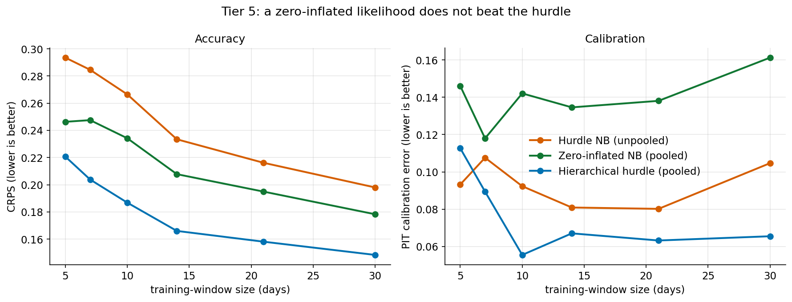

# Zero-inflated likelihood (Tier 5)

This document covers the Tier-5 prototype: a hierarchical **Zero-Inflated
Negative Binomial (ZINB)** model, built to test the "tighter likelihood"
direction that Tier 4 ([`bayesian.md`](bayesian.md)) pointed to. It is further
support for the VulnOptiCON follow-up to arXiv:2604.16038.

## The question

Tier 4 found that the binding problem in this regime is *excess dispersion* —
every model over-covers (empirical 80% interval coverage ≈ 0.96 vs nominal 0.80),
so predictive distributions are too wide. It argued the productive next step is a
*tighter likelihood* rather than heavier inference, and named a zero-inflated
formulation as a candidate. Tier 5 builds and evaluates it. **The answer, again,
is that it does not beat the empirical-Bayes hurdle of Tier 2** — an informative
negative result.

## Model

The hurdle (Tiers 2–3) treats zeros and positives with two entirely separate
processes; its positive part is a heavy-tailed `1 + NB` whose pooled dispersion
is large. A zero-inflated model instead lets a single NB component generate the
data, with an extra structural-zero gate:

```
y = 0              with prob  pi_c                 (structural zero)
y ~ NB2(mu_c, r)   with prob  1 - pi_c             (NB may also yield 0)
```

so the *same* NB explains the small positive counts and some of the zeros. We
pool exactly as before: `pi_c ~ Beta(a,b)`, `mu_c ~ Gamma(kappa, theta)`, with a
shared dispersion `r`. Because ZINB does not factorise (a zero may come from
either component), there is no conjugate update; we fit `(pi_c, mu_c)` by
**MAP expectation–maximisation** with the population Beta/Gamma priors acting as
pseudo-counts (this is what produces the shrinkage), and fit `r` once on the
back-catalogue. numpy/scipy only.

The implementation is validated on synthetic ZINB data (recovers `pi=0.61` vs
true 0.60, `mu=3.01` vs 3.0). On the corpus the population fit is
`pi ≈ 0.55` structural zeros, NB `mu ≈ 1.24`, shared `r ≈ 1.0` — i.e.\ a
geometric-like, still heavy-tailed count component.

## Experiment

Identical data-starvation protocol to Tiers 2–4 (fixed window `W`, leave-one-out
population fit, 24 CVEs, `H=7`). We compare the hierarchical ZINB against the
empirical-Bayes hurdle (Tier 2, the model to beat) and the best unpooled model.
Reproduce: `python -m tardissight.eval.run_zeroinflated 2>/dev/null`.

## Results



**CRPS by window** (lower is better):

| model | W=5 | W=7 | W=10 | W=14 | W=21 | W=30 |
|---|---:|---:|---:|---:|---:|---:|
| hier_hurdle (empirical Bayes) | **0.221** | **0.204** | **0.187** | **0.166** | **0.158** | **0.148** |
| zinb_hier (zero-inflated) | 0.246 | 0.248 | 0.234 | 0.208 | 0.195 | 0.178 |
| indep_hurdle_nb (unpooled) | 0.293 | 0.285 | 0.266 | 0.233 | 0.216 | 0.198 |

**PIT calibration error by window** (lower is better):

| model | W=5 | W=7 | W=10 | W=14 | W=21 | W=30 |
|---|---:|---:|---:|---:|---:|---:|
| hier_hurdle (empirical Bayes) | **0.113** | **0.089** | **0.055** | **0.067** | **0.063** | **0.065** |
| zinb_hier (zero-inflated) | 0.146 | 0.118 | 0.142 | 0.135 | 0.138 | 0.161 |
| indep_hurdle_nb (unpooled) | 0.093 | 0.108 | 0.092 | 0.081 | 0.080 | 0.105 |

80% interval coverage: hurdle ≈ 0.96, ZINB ≈ 0.97, unpooled ≈ 0.96 — the ZINB does
**not** tighten the intervals; if anything it over-covers slightly more.

## Finding: the hurdle's clean zero-separation wins

Two things are worth separating:

1. **Pooling still works for ZINB.** The hierarchical ZINB clearly beats the
   *unpooled* hurdle on CRPS at every window — borrowing strength helps this
   likelihood too. So the negative result is about the *likelihood*, not pooling.

2. **But the zero-inflated likelihood is worse than the hurdle**, on CRPS and —
   markedly — on calibration, where it is the *worst* of the three. The reason is
   mechanistic. Fit honestly, the ZINB count component lands at `r ≈ 1`
   (geometric-like), so it remains heavy-tailed and does not tighten the
   predictive at all. More fundamentally, on these series the "active vs silent"
   distinction is well defined, and the hurdle exploits it directly: a Bernoulli
   gate on *observed* activity, and a count model fit only to the positive days.
   ZINB instead *softly* attributes each zero between its structural gate and its
   NB component, which is statistically less efficient when the zeros really are
   structural — and it leaks dispersion from the bursts into the zero-day
   predictions.

## Takeaway

Combined with Tier 4, this is the second extension that fails to beat the
empirical-Bayes hurdle: neither richer inference (full Bayes) nor an alternative
zero-handling likelihood (zero-inflation) improves on it. Together they make a
strong robustness case — **the empirical-Bayes hierarchical hurdle is the
recommended model**, and the residual over-coverage appears to be an *intrinsic*
property of forecasting such sparse, bursty counts at a 7-day horizon (a
discreteness/zero artefact that inflates coverage regardless of likelihood),
rather than a deficiency a different count distribution can engineer away. PIT,
not coverage, is the discriminating calibration gauge here, and the hurdle wins
it.

## Next steps

The remaining untried "tighter likelihood" idea is to model the **dependence**
the current models omit — between the activity gate and the burst size, and (in
the typed model) between PoC and exploitation — rather than swapping the marginal
count distribution. That, and a global cross-learning forecaster, are the open
directions; the evaluation harness is ready to score them.
